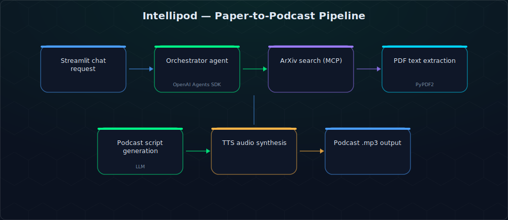
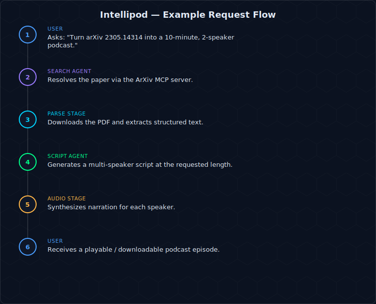

# Intellipod — AI-Powered Research Podcast Generator


Turns a dense research paper into a listenable podcast. Search arXiv (or hand it a paper ID), and a small team of LLM agents finds the paper, reads it, writes a script, and synthesizes audio — in 3, 10, or 30-minute formats.

## What it does

Reading papers is slow; listening on a walk isn't. Intellipod runs a **multi-agent pipeline** built on the OpenAI Agents SDK: a search agent queries arXiv (via a dedicated MCP server) and resolves the right paper, a parsing stage extracts and structures the PDF text, a scripting agent turns that into a natural, multi-speaker podcast script, and an audio stage synthesizes the final narration. Everything is driven through a conversational **Streamlit** interface.



## Key features

- **Conversational search** — find papers by keyword, author, or arXiv ID through natural language
- **Multi-agent orchestration** — specialized agents for search, download, scripting, and audio, coordinated by an orchestrator with shared session memory
- **ArXiv MCP server** — exposes paper search/download as MCP tools, decoupling the agent logic from the arXiv API
- **Configurable scripts** — choose podcast duration (5–30 min), speaker count, and speaker gender mix
- **PDF → script → audio** in one flow, with the finished episode playable or downloadable directly from the UI

## Demo


## User flow



### Example interaction *(illustrative — not a captured live session)*

> **User:** "Turn arXiv 2305.14314 into a 10-minute, 2-speaker podcast."
>
> **Intellipod:** "Found 'QLoRA: Efficient Finetuning of Quantized LLMs' (2305.14314). Generating a 10-minute, 2-speaker script… done — here's your episode: `qlora_episode.mp3`."

## Real-world application

This sits in the same "research-to-audio" category that tools like Google's NotebookLM popularized — except scoped specifically to arXiv, with the search/download/script/audio stages split into separate MCP-callable agents rather than one monolithic prompt. That separation is what makes each stage independently testable and swappable (e.g. trying a different TTS backend without touching the scripting logic).

## Tech stack

`Python` · `OpenAI Agents SDK` · `Model Context Protocol (MCP)` · `LangChain` (conversation memory) · `arxiv` API · `PyPDF2` · `pydub` · `OpenAI TTS` · `Streamlit`

## Repository structure

```
arxiv_podcast/
├── main.py                  # App entry point
├── ui/app.py                 # Streamlit chat interface
├── agents_l/
│   ├── orchestrator.py       # Defines + wires the agent team
│   ├── context.py            # Shared app/session context
│   └── memory.py             # Conversation memory helpers
├── core/
│   ├── search.py              # ArXiv search/download tools
│   ├── parse.py                # PDF text extraction
│   ├── podcast.py              # Script generation
│   └── audio.py                 # TTS audio synthesis
├── arxiv_mcp_server.py        # MCP server exposing arXiv tools
└── arxiv_mcp_client.py         # MCP client used by the agents
```

## Setup

```bash
git clone https://github.com/ananthakrishna4747/paper_to_podcast.git
cd paper_to_podcast/arxiv_podcast
python -m venv venv
source venv/bin/activate        # Windows: venv\Scripts\activate
pip install -r requirements.txt
```

Create a `.env` file:
```
OPENAI_API_KEY=your_openai_api_key_here
OPENAI_MODEL_ID=ft:gpt-4o-mini-2024-07-18:personal::BM4yUkOI   # or your preferred model
```

Run it:
```bash
streamlit run main.py
```
This opens the app at `http://localhost:8501`.

## Workflow

1. **Search** — enter a topic, author, or arXiv ID in the chat
2. **Select** — pick a paper from the results
3. **Process** — the app downloads and extracts the paper's text
4. **Configure** — choose duration, speaker count, and speaker genders
5. **Generate** — the script and audio are produced automatically
6. **Listen** — play in-browser or download the `.mp3`

## Roadmap

- [ ] Docker packaging for one-command setup (currently a local venv + Streamlit run)
- [ ] Thin FastAPI gateway in front of the agent pipeline to support multiple concurrent users
- [ ] Kubernetes manifests for scaling audio-synthesis workers independently from the script-generation agents
- [ ] Vector store cache of parsed papers so repeat queries skip re-parsing the PDF
- [ ] GitHub Actions CI for linting and a smoke test on the agent pipeline

## License

No license file is currently included in this repository — treat as personal/educational project code.
